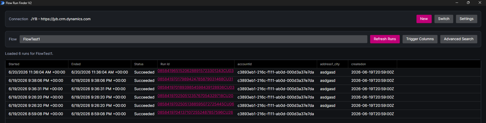
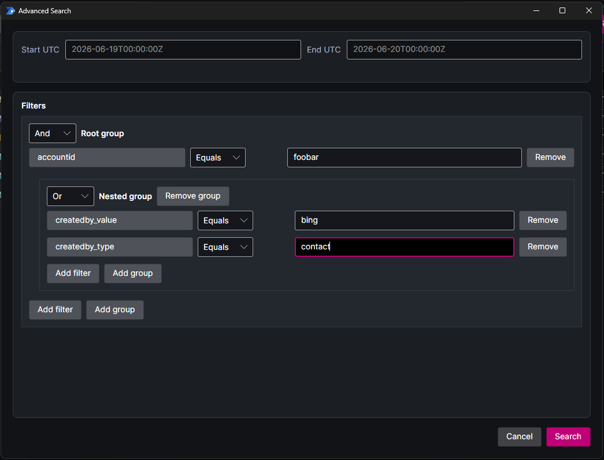

<p align="center">
  
</p>

# Flow Run Finder V2

Flow Run Finder V2 is a desktop tool for finding Power Automate flow runs and inspecting the related trigger data.

It is useful when you know a flow ran, but need to answer questions like:

- Which run handled this record?
- What trigger payload did the flow receive?
- Did any runs fire for this account, contact, row id, user id, status, or other trigger value?
- What happened during a specific UTC time window?
- Which trigger fields are worth comparing across recent runs?

## Features

- Named Dataverse/Power Platform connections with cached device-code auth.
- Recent Power Automate run history loaded directly from the environment API.
- Dynamic trigger-output columns, remembered per flow.
- Searchable flow and trigger-field pickers.
- Advanced UTC time-window search with grouped `AND` / `OR` filters.
- `Equals` and `Contains` matching for trigger output fields.
- Run links to make.powerautomate.com, plus right-click copy.
- Local daily logs with configurable verbosity.

## Screenshots





## Setting Up A Connection

When the app starts, choose an existing connection or create a new one.

For a new connection, enter:

- a friendly name, like `prod` or `uat`
- the Dataverse environment URL, like `https://contoso.crm.dynamics.com`

The app will show a Microsoft device login URL and code. Open the URL in your browser, enter the code, and finish signing in.

Connection metadata and token caches are stored locally under:

```text
%LOCALAPPDATA%\FlowRunFinderV2\connections
```

## Using The Tool

After connecting, pick a cloud flow from the flow picker. The app loads the latest runs and shows the run start time, end time, status, and run id.

Use `Trigger Columns` to choose which trigger output fields should appear in the grid. The list is based on the trigger payloads returned for the loaded runs, so it can include custom Dataverse columns and dynamic trigger values.

Use `Advanced Search` when recent runs are not enough. Set a UTC start and end time, then add filters against trigger output fields. You can group filters with `AND` and `OR`, which is useful for searches like:

```text
accountid equals {GUID}
AND
statuscode equals 1
```

or:

```text
name contains test
OR
websiteurl contains contoso
```

Advanced search scans run history newest-to-oldest. It avoids loading trigger payloads until a run is inside the requested time window, which keeps older searches from doing unnecessary work.

## Local Files

The app keeps its local data here:

```text
%LOCALAPPDATA%\FlowRunFinderV2
```

Notable files and folders:

- `settings.json`: app settings and selected trigger columns
- `connections`: saved connection profiles and token caches
- `logs`: daily log files

## Development

| Project | Description |
| --- | --- |
| `FlowRunFinderV2.Core` | Reusable [.NET](https://dotnet.microsoft.com/) application logic with no [Avalonia](https://avaloniaui.net/) dependency. |
| `FlowRunFinderV2.UI` | The [Avalonia](https://avaloniaui.net/) desktop app, dialogs, windows, app resources, UI-specific converters, and run grid built with [Avalonia DataGrid](https://docs.avaloniaui.net/docs/reference/controls/datagrid/). |

| Namespace | Description |
| --- | --- |
| `FlowRunFinderV2.Core.Auth` | Microsoft device-code authentication and token cache wiring through [MSAL.NET](https://learn.microsoft.com/entra/msal/dotnet/). |
| `FlowRunFinderV2.Core.Client` | API clients for [Dataverse](https://learn.microsoft.com/power-apps/developer/data-platform/) flow metadata and [Power Automate](https://www.microsoft.com/power-platform/products/power-automate) run history. |
| `FlowRunFinderV2.Core.Configuration` | Local connection profiles and app settings. |
| `FlowRunFinderV2.Core.Logging` | Local file logging. |
| `FlowRunFinderV2.Core.Model` | Cloud flow and run models. |
| `FlowRunFinderV2.Core.Query` | Run query and advanced-search filtering logic. |

#### Publish

```powershell
dotnet publish .\src\FlowRunFinderV2\FlowRunFinderV2.UI\FlowRunFinderV2.UI.csproj /p:PublishProfile=FolderProfile
```

The executable is written to `src\FlowRunFinderV2\FlowRunFinderV2.UI\bin\Release\net8.0\win-x64\publish`.

## AI Disclosure
- AI-assisted tooling was used in the development of this codebase.

## License
- License: [MIT](LICENSE)
